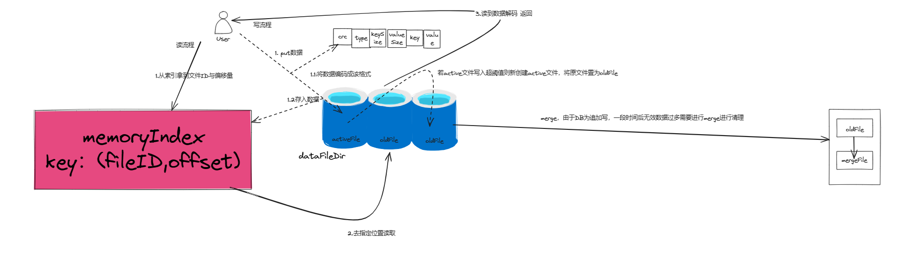
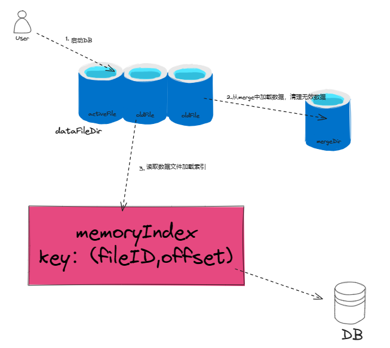
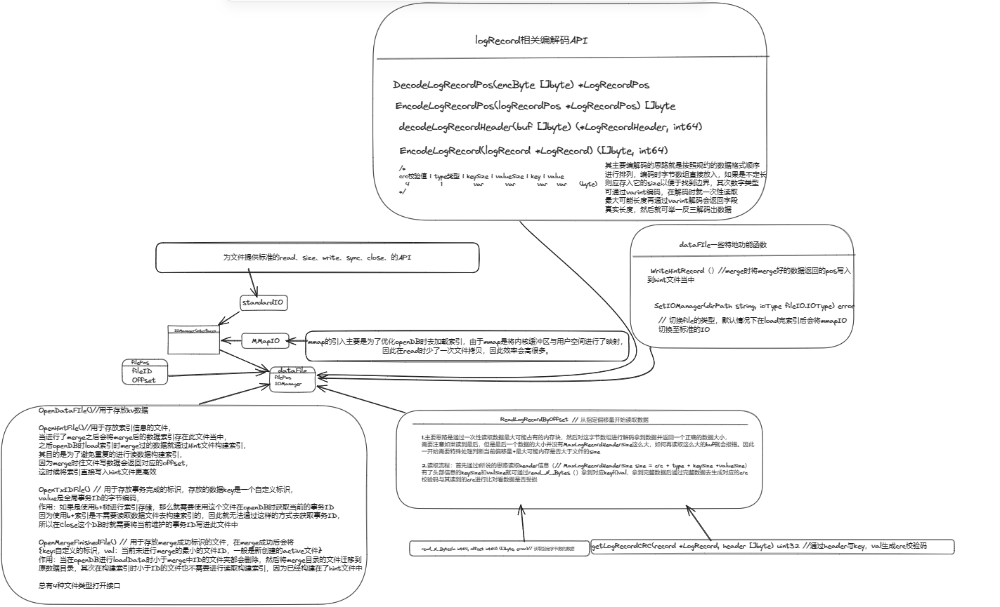

# 学习kv数据库从0到1的搭建与实现


# 操作演示：
```go
// put、get、open
db, _ := OpenWithOptions(model.DefaultOptions)
db.Put([]byte("key1"))
db.Get([]byte("key1"))

// merge
db.Merge()

// writeBatch
wb := db.NewWriteBatch(model.DefaultWriteBatchOptions)
for i := 0; i < 100; i++ {
err = wb.Put([]byte("255344"+strconv.Itoa(i)), []byte(strconv.Itoa(i)))
assert.Nil(t, err)
}
err = wb.Commit()


// 兼容redis接口
rds, _ := NewRedisDateStructure(db)
rds.Set(pkg.GetTestKey(1), pkg.RandomValue(100), 0)
rds.Get(pkg.GetTestKey(1))


//cmd redis兼容
//go run ./cmd/main.go
//redis :redis-cli -p:3680
//set a b
```

# bitcask基本思路：





# 类图逻辑：
## dataFile相关




## engine相关


绘制bitcask模型启动、读、写、merge主要思路、DB引擎主要模块流程UML图
https://excalidraw.com/#json=xlbPUplaiIwbfhQnWM9uF,muh6zmGdn8AYE3CvIDg3ZQ

---


## 知识空缺查漏：
ps:在此项目常使用varint编码将数字压缩存入byte数组中 n int--->x []byte

粗糙看了下varint编码原理，其实是将n每次取出低七位的数字 即byte(n)|0x80-->存入到byte[i],i=0,1,2,3....

因此byte数组存储的实质上是该数字的小端序

因此maxVarint64为10 因为7*9+1=64，所以需要10字节
依次举一反三： maxVarint32为5

# todo:
+ 1.优化读取流程，将数据布局分为一块一块的数据块，每次读数据读出一块放入内存，由于空间、时间局部性，周围的数据大概率也会在近期被读取，此操作可减少读数据的系统调用、数据拷贝的cpu消耗
+ 2.现目前只完成了批量写入的原子性、后续参考mysql的事务ACID实现隔离性等
+ 3.陆续实现redis中数据结构的API兼容
